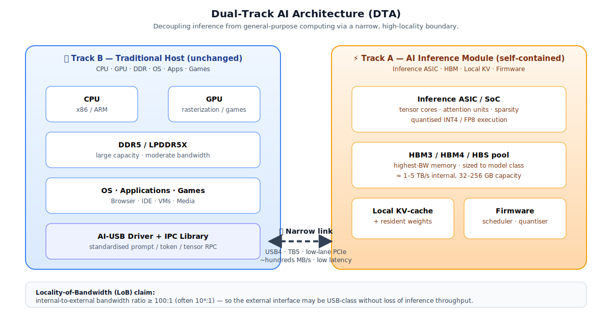
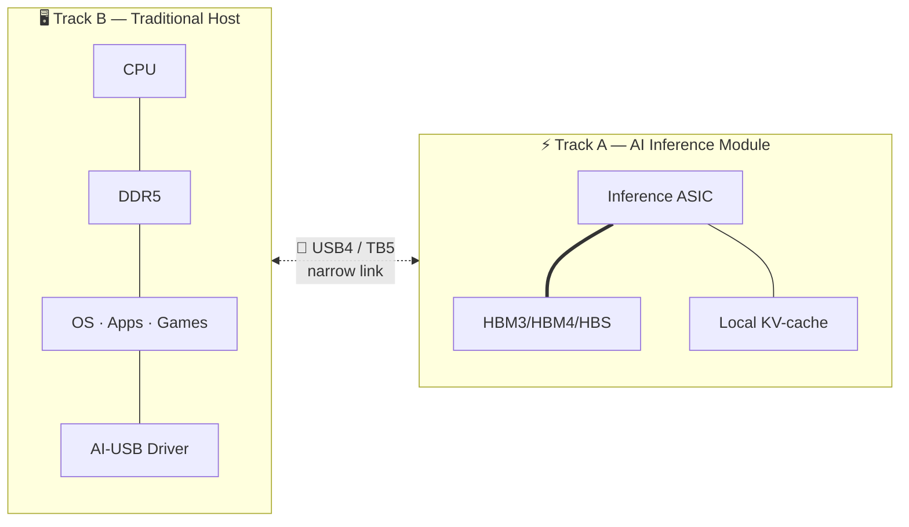

# Dual-Track AI Architecture (DTA)

> **Decoupling AI inference from general-purpose computing via narrow-interface accelerators.**
>
> A working proposal for how to get big-model AI on your desk **without** rebuilding your computer around it.

[](./LICENSE)
[](./paper.md)

---

## TL;DR

The industry's mainstream plan for the AI memory wall is to rebuild the entire computer around memory (Samsung Jung Kwan-ho's "100-story 3D chip" vision, HBM-everywhere designs, memory-centric OSes).

We think that's more ambition than we need.

**Encapsulate AI inference as a self-contained module** with its own top-tier HBM inside, and connect it to a normal PC over a **deliberately narrow link** — USB4, Thunderbolt, or a couple of PCIe lanes. Games and the OS stay on the traditional track. AI becomes an **additive, hot-swappable, incrementally-upgradeable** component, the way discrete GPUs once split off from integrated graphics.

The load-bearing assumption is the **Locality-of-Bandwidth (LoB)** hypothesis: the bandwidth-hungry parts of inference (weight streaming, KV-cache refresh, activation traffic) live **inside** the module. Only prompts and generated tokens cross the boundary. The ratio is easily 10⁴:1.

If LoB holds, you don't need a new computer for AI. You need a new dongle.

---

## Repository Layout

```
dual-track-ai-architecture/
├── README.md                                — this file
├── paper.md                                 — full working draft paper (EN + 中文摘要)
├── LICENSE                                  — CC BY 4.0
└── diagrams/
    ├── dual_track_architecture.svg          — system overview (rendered)
    ├── dual_track_architecture.mmd          — same, in Mermaid
    └── locality_of_bandwidth.mmd            — LoB traffic diagram
```

---

## The Architecture at a Glance





- **Track B** (host): commodity CPU + GPU + DDR + OS. **Nothing changes.** Your games, your Photoshop, your VS Code, your Docker — all keep working the way they do today.
- **Track A** (AI Inference Module, AIM): dedicated inference silicon with **HBM-class internal memory**. Big models live here. Weights, KV-cache, activations all stay resident.
- **The link**: a narrow bus. Hundreds of MB/s is plenty. USB4 (5 GB/s) is already overkill.

## The Key Bet: Locality of Bandwidth

For LLM decoding of a 70B model at INT4, per token:

- **Inside the module**: ≈ 35 GB weight-read + hundreds of MB of KV-cache traffic. At 50 tok/s, that's ≈ **1.75 TB/s** of internal pressure.
- **Across the boundary**: a few bytes of generated token, plus modest control overhead.

Ratio in the pathological limit: **10¹⁰ : 1**. Even worst-case realistic streaming stays above **10⁴ : 1**.

So the external boundary is not the bottleneck. It never was — we've just been assuming everything must live in one chassis.

## Why This Matters

1. **Consumer upgrade path.** You don't buy a new machine for AI. You buy an "AI puck" and plug it in.
2. **Faster iteration.** AIM vendors compete on tokens-per-dollar without dragging the OS and PC ecosystem behind them.
3. **Failure isolation.** If your AIM overheats, your OS doesn't hang.
4. **Mobile & edge.** A dongle-form AIM is thermally realistic in places a full memory-centric machine is not.
5. **Standards leverage.** Whoever owns the "AI-USB" interface owns a platform tax analogous to USB-IF and Wi-Fi Alliance.

## Open Questions

Read the [paper](./paper.md) for the full list. Highlights:

- Does LoB survive very long-context prefill (128k+ tokens)?
- How is KV-cache portability handled when a user switches host machines?
- What's the right standard model IR to avoid vendor lock-in?
- USB4 round-trip latency floor vs interactive UX — is it good enough?
- Thermal density: a 70B-class dongle is a small radiator. What form-factor wins?

## Related & Adjacent Work

- **NVIDIA DGX Spark / Project DIGITS** — closest existing hardware; too expensive, too coupled to network stack.
- **Apple Neural Engine (M-series)** — a Track-A shard, but embedded, not external.
- **Qualcomm Hexagon NPU** — right idea at small scale, needs to scale up.
- **Thunderbolt eGPU enclosures** — proof-of-concept that valuable compute can sit outside the box.
- **Google Coral / Hailo / Rockchip USB NPUs** — existence proofs at the small-model end.

The gap this repo argues for: **HBM-class internal memory + narrow external link + LLM-class capacity + consumer plug-and-play**. No shipping product hits all four today.

## Contributing

This is an early idea, not a finished framework. We want:

- **Empirical measurements.** Real workloads, real bandwidth traces, real LoB numbers.
- **Counter-arguments.** Cases where LoB breaks down.
- **Prior art.** Papers or products we missed.
- **Diagrams & prose.** Improvements welcome.

Open an issue or a pull request. Keep it substantive; no hype.

## Authors

- **猛奇奇 (Meng Qiqi)** — seed idea, architectural intuition.
- **悟色** — initial framing, industry-parallel analysis.
- **大聪明** — paper drafting, repository preparation.

## License

Text and figures released under **[Creative Commons Attribution 4.0 International (CC BY 4.0)](./LICENSE)** — reuse freely with attribution.

## Citation

If you find this idea useful in later work, please cite as:

```bibtex
@misc{dta2026,
  author = {Meng, Qiqi and 悟色 and 大聪明},
  title  = {Dual-Track AI Architecture: Decoupling Inference from General-Purpose Computing via Narrow-Interface Accelerators},
  year   = {2026},
  howpublished = {\url{https://github.com/lilei0311/dual-track-ai-architecture}},
  note   = {Working draft v0.1}
}
```
